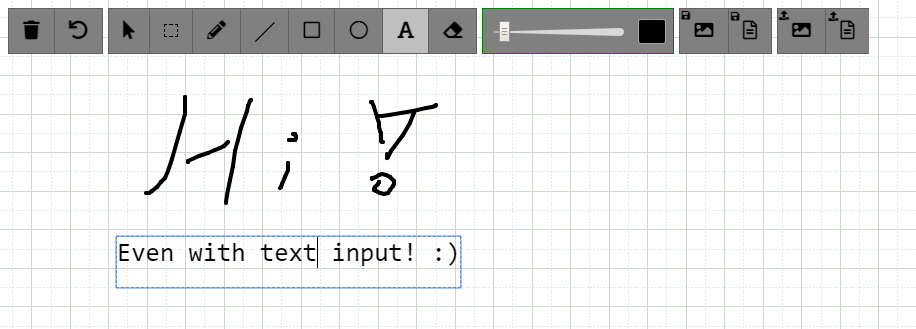

# whiteboard

This is a lightweight NodeJS collaborative Whiteboard/Sketchboard which can easily be customized...



## Demowhiteboard

[HERE](https://cloud13.de/testwhiteboard/) (Reset every night)

## Some Features

- Shows remote user cursors while drawing
- Undo / Redo function for each user
- Drag+Drop / Copy+Paste Images or PDFs from PC and Browsers
- Resize, Move, Rotate & Draw Images to Canvas or Background
- Write text and sticky notes
- Save Whiteboard to Image and JSON
- Draw angle lines by pressing "Shift" while drawing (with line tool)
- Draw square by pressing "Shift" while drawing (with rectangle tool)
- Indicator that shows the smallest screen participating
- Keybindings for ALL the functions
- REST API
- Working on PC, Tablet & Mobile

## Projects using this Whiteboard

- [Meetzi](https://meetzi.de/) - WebRtc Conference tool
- [LAMS](https://www.lamsfoundation.org) - Managing and delivering online Collaboration learning activities
- [Accelerator](https://github.com/cracker0dks/Accelerator) - WebRtc Conference tool
- Your Project here...

## Install the App

You can run this app with and without docker

### Without Docker

1. install the latest NodeJs (version >= 12)
2. Clone the app
3. Run `npm ci` inside the folder
4. Run `npm run start:prod`
5. Surf to http://YOURIP:8080

### With Docker

1. `docker run -d -p 8080:8080 rofl256/whiteboard`
2. Surf to http://YOURIP:8080

## Development

After you have installed the app, run `npm run start:dev` to start the backend and a frontend development server. The website will be accessible on http://locahost:8080.

## Default keyboard shortcuts

Use keyboard shortcuts to become more productive while using Whiteboard.

They are especially useful if you work with interactive displays such as XP-Pen Artist, Huion Kamvas and Wacom Cintiq. These devices have quick buttons (6-8 buttons and scrolling). By default, the buttons on these displays are mapped to standard Photoshop keyboard shortcuts. Keys can be configured to function effectively in other software.

The following are predefined shortcuts that you can override in the file [./src/js/keybinds.js](./src/js/keybinds.js)

| Result                                                           | Windows and Linux    | macOS                   |
| ---------------------------------------------------------------- | -------------------- | ----------------------- |
| Clear the whiteboard                                             | Ctrl + Shift + Z     | Command + Shift + Z     |
| Undo your last step                                              | Ctrl + Z             | Command + Z             |
| Redo your last undo                                              | Ctrl + Y             | Command + Y             |
| Select an area                                                   | Ctrl + X             | Command + X             |
| Take the mouse                                                   | Ctrl + M             | Command + M             |
| Take the pen                                                     | Ctrl + P             | Command + P             |
| Draw a line                                                      | Ctrl + L             | Command + L             |
| Draw a rectangle                                                 | Ctrl + R             | Command + R             |
| Draw a circle                                                    | Ctrl + C             | Command + C             |
| Toggle between line, rectangle and circle                        | Ctrl + Shift + F     | Command + Shift + F     |
| Toggle between pen and eraser                                    | Ctrl + Shift + X     | Command + Shift + X     |
| Toggle between main clolors (black, blue, green, yellow and red) | Ctrl + Shift + R     | Command + Shift + R     |
| Write text                                                       | Ctrl + A             | Command + A             |
| Take the eraser                                                  | Ctrl + E             | Command + E             |
| Increase thickness                                               | Ctrl + Up Arrow      | Command + Up Arrow      |
| Decrease thickness                                               | Ctrl + Down Arrow    | Command + Down Arrow    |
| Colorpicker                                                      | Ctrl + Shift + C     | Command + Shift + C     |
| Set black color                                                  | Ctrl + Shift + 1     | Command + Shift + 1     |
| Set blue color                                                   | Ctrl + Shift + 2     | Command + Shift + 2     |
| Set green color                                                  | Ctrl + Shift + 3     | Command + Shift + 3     |
| Set yellow color                                                 | Ctrl + Shift + 4     | Command + Shift + 4     |
| Set red color                                                    | Ctrl + Shift + 5     | Command + Shift + 5     |
| Save whiteboard as image                                         | Ctrl + S             | Command + S             |
| Save whiteboard as JSON                                          | Ctrl + Shift + K     | Command + Shift + K     |
| Save whiteboard to WebDav                                        | Ctrl + Shift + I (i) | Command + Shift + I (i) |
| Load saved JSON to whiteboard                                    | Ctrl + Shift + J     | Command + Shift + J     |
| Share whiteboard                                                 | Ctrl + Shift + S     | Command + Shift + S     |
| Hide or show toolbar                                             | Tab                  | Tab                     |
| Move selected object up                                          | Up Arrow             | Up Arrow                |
| Move selected object down                                        | Down Arrow           | Down Arrow              |
| Move selected object left                                        | Left Arrow           | Left Arrow              |
| Move selected object right                                       | Right Arrow          | Right Arrow             |
| Drop object                                                      | Ctrl + Enter         | Command + Enter         |
| Add Image to background                                          | Shift + Enter        | Shift + Enter           |
| Cancel all actions                                               | Escape               | Escape                  |
| Delete selected object                                           | Delete               | Delete                  |
| Use Line tool when pen is active (Not changeable)                | Shift (Hold)         | Shift (Hold)            |

## URL Parameters

Call your site with GET parameters to change the WhiteboardID or the Username

`http://YOURIP:8080?whiteboardid=MYID&username=MYNAME`

- whiteboardid => All people with the same ID are drawing on the same board
- username => The name which will be shown to others while drawing
- title => Change the name of the Browser Tab
- randomid => if set to true, a random whiteboardId will be generated if not given aswell
- copyfromwid => set this to a whiteboardId you want a copy from. Only copies the content if the current whiteboard is empty.

## Configuration

Many settings of this project can be set using a simple `yaml` file, to change some behaviors or tweak performances.

### Config. file

To run the project with custom settings:

1. Create a `config.run.yml` file based on the content of [`config.default.yml`](./config.default.yml),
2. Change the settings,
3. Run the project with your custom configuration (it will be merged into the default one):

- locally: `node scripts/server.js --config=./config.run.yml`
- docker: `docker run -d -p 8080:8080 -v $(pwd)/config.run.yml:/config.run.yml:ro rofl256/whiteboard --config=/config.run.yml`

### Highlights

#### Security - AccessToken (Optional)

To prevent clients who might know or guess the base URL from abusing the server to upload files and stuff, you can set an accesstoken at server start (see [here](./config.default.yml)).

Then set the same token on the client side as well:

<b>Client (With and without docker):</b> `http://YOURIP:8080?accesstoken=mySecToken&whiteboardid=MYID&username=MYNAME`

Done!

#### REST API

You can fully control the whiteboard through a REST API. Explore and test the API for your server version by surfing to: `[yourRootWhiteboardUrl]/apidoc/index.html`
You can see the API for the Demowhiteboard here: [DemoAPI](https://cloud13.de/testwhiteboard/apidoc/index.html)

Note: This API is pretty new, so be sure to use the latest Whiteboard version.

#### WebDAV (Optional)

This function allows your users to save the whiteboard directly to a webdav server (Nextcloud) as image without downloading it.

To enable set `enableWebdav` to `true` in the [configuration](./config.default.yml).

Then set the same parameter on the client side as well:

<b>Client (With and without docker):</b> `http://YOURIP:8080?webdav=true&whiteboardid=MYID&username=MYNAME`

Refresh the site and You will notice an extra save button in the top panel. Set your WebDav Parameters, and you are good to go!

Note: For the most owncloud/nextcloud setups you have to set the WebDav-Server URL to: https://YourDomain.tl/remote.php/webdav/

Done!

### And many more (performance, etc.)

Many more settings can be tweaked. All of them are described in the [default config file](./config.default.yml).

## Things you may want to know

- Whiteboards are gone if you restart the Server enable "enableFileDatabase" in the config file or export the board to prevent that.
- You should be able to customize the layout without ever touching the whiteboard.js (take a look at index.html & main.js)

## ToDo

- Make undo function more reliable on texts

## Nginx Reverse Proxy configuration

Add this to your server part:

```
    location /whiteboard/ {
        proxy_set_header HOST $host;
        proxy_http_version 1.1;
        proxy_set_header Upgrade $http_upgrade;
        proxy_set_header Connection upgrade;
        proxy_pass http://YOURIP:8080/;
    }
```

To run it at /whiteboard. Don't forget to change -> YOURIP!

## Apache Reverse Proxy configuration

```
<VirtualHost example.org:443>
...
# Proxy /whiteboard/ to whiteboard container
ProxyPass "/whiteboard/" "http://YOURIP:8080/"
ProxyPassReverse "/whiteboard/" "http://YOURIP:8080/"
...
</VirtualHost>
```

To run it at /whiteboard. Don't forget to change -> YOURIP!

## Nextcloud integration

1. Install this app on your server
2. Enable and go to "external sites" (app) on your Nextcloud
3. Add a link to your server: `https://YOURIP/whiteboard/?whiteboardid=WHITEBOARDNAME&username={uid}`
   You can give each group its own whiteboard by changeing the WHITEBOARDNAME in the URL if you want.

Note: You might have to serve the app with https (If your nextcloud server runs https). To do so, its recommend to run this app behind a reverse proxy. (as shown above)

#### (Optional) Set whiteboard icon in nextcloud


Upload both icons present at /doc/nextcloud_icons/ to your nextcloud at the "external sites" admin section. Then set it as symbol on your link.

**_ MIT License _**
